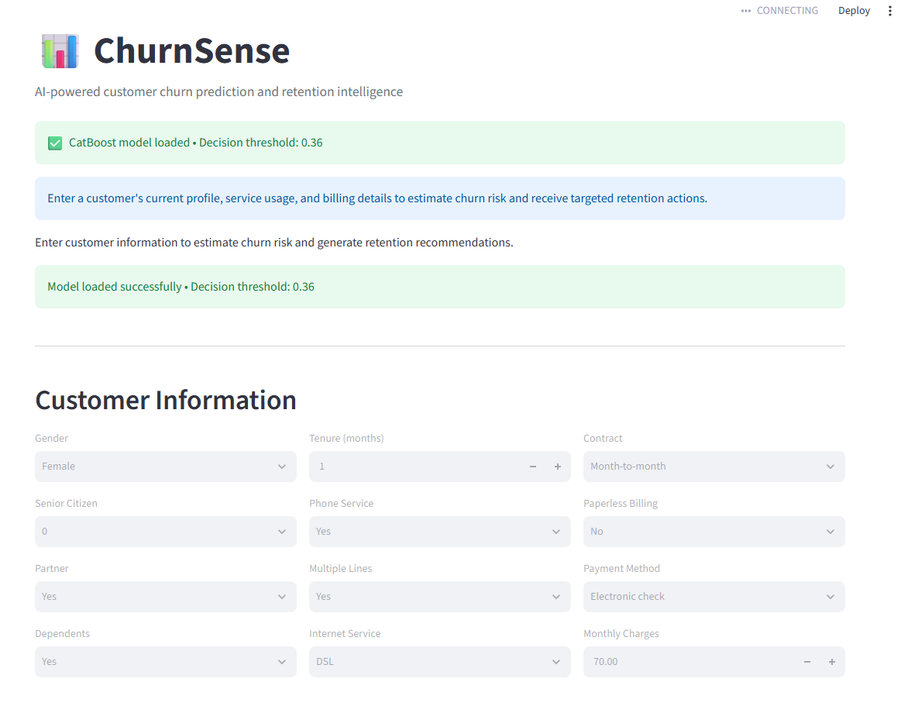
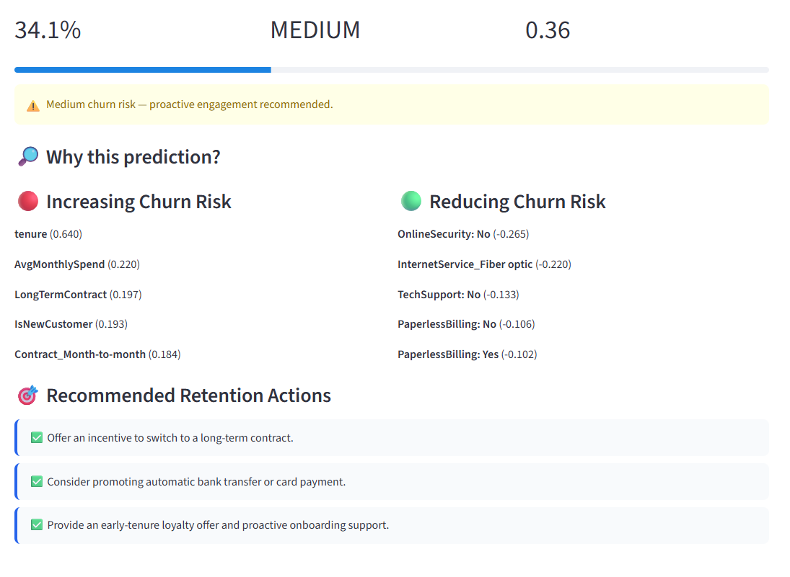

# ChurnSense

AI-powered customer churn prediction and retention intelligence platform.

ChurnSense predicts customer churn probability, explains predictions using SHAP, assigns risk levels, and generates actionable retention recommendations.

---

## 🚀 Features

- Customer churn probability prediction
- Risk classification
- Hyperparameter-tuned ML models
- Decision threshold optimization
- SHAP-based explainability
- Customer-specific risk factors
- Retention recommendation engine
- Interactive Streamlit dashboard

---

## 🏗️ ML Pipeline

Raw Data
→ Data Cleaning
→ EDA
→ Feature Engineering
→ Preprocessing
→ Model Benchmarking
→ Hyperparameter Tuning
→ Threshold Optimization
→ SHAP Explainability
→ Retention Recommendations
→ Streamlit Deployment

---

## 🤖 Model Comparison

| Model | ROC-AUC | PR-AUC |
|---|---:|---:|
| Tuned XGBoost | 0.8465 | 0.6558 |
| Tuned CatBoost | 0.8461 | 0.6648 |
| Tuned LightGBM | 0.8455 | 0.6556 |
| Tuned Gradient Boosting | 0.8445 | 0.6631 |

### Final Model

**CatBoost**

Selected based on the overall balance of ROC-AUC, PR-AUC, recall and F1 for the churn class.

---

## 🎚️ Threshold Optimization

Instead of relying on the default 0.50 threshold, the decision threshold was selected using validation data.

**Selected CatBoost threshold: 0.36**

Final test performance:

- Precision: ~0.57
- Recall: ~0.71
- F1: ~0.64
- ROC-AUC: ~0.85
- PR-AUC: ~0.66

---

## 🔎 Explainable AI

SHAP is used to explain both global model behavior and individual customer predictions.

The application identifies factors that:

- Increase churn risk
- Reduce churn risk

Examples include tenure, contract type, online security, technical support, payment method, and internet service.

---

## 🎯 Retention Recommendations

ChurnSense converts customer characteristics into transparent retention actions.

Example:

Month-to-month contract  
→ Offer an incentive to switch to a long-term contract

No Online Security  
→ Offer an Online Security package or trial

No Tech Support  
→ Offer a discounted Tech Support package

---

## 🖥️ Streamlit Application

The dashboard allows users to enter customer information and receive:

**Churn Probability → Risk Level → SHAP Explanation → Retention Actions**

---

## 📸 Dashboard

### Customer Input

.png)

### Churn Prediction & Explainability

